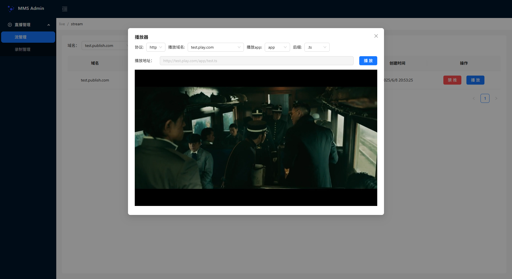

# Introduction
this project is write in vue3, use ant design vue 4.x frame work, and is used for mms-server's single server console.

# Build
```
npm install
```

# Debug mode
in debuging phase you might wish to run
```
npm run dev -- --host 0.0.0.0
```

and you can open http://localhost:5173/ to browse the console.

in debug phase, you need to set the mms-server api location by modify the src/api/config.ts file:
``` javascript
const header = {
    Accept: 'application/json;charset=UTF-8',
}

const getBaseUrl = () => {
    if (import.meta.env.MODE === 'development') {
        return 'http://192.168.108.211:8080'
    }

    const protocol = window.location.protocol;
    const hostAndPort = window.location.host;
    return protocol + "//" + hostAndPort;
};

export default {header, getBaseUrl};
```
modify the http://192.168.108.211:8080 to your self server addr.

# Release Mode
* **build** 

in release mode, you first need to run
```
npm run build
```
to generate the deployment files in the top direcory console
* **deploy**

then you need to copy the files to the directory of mms server's static file directory, for example in mms.yaml, you config the console directory like this:
``` yaml
http_api:
  enabled: true
  port: 8080
  static_file_server:
    enabled: true
    path_map:
      /console/*: /data/console
``` 
then you need to copy the console directory to /data/console
* **visit**
after deploy, you start mms-server:
```
../bin/mms-live-server -c ../bin/config -d
```
then you can visit the console by:
http://ip:8080/console/index.html

* **player**

we support many format player：hls,flv,mpegts

